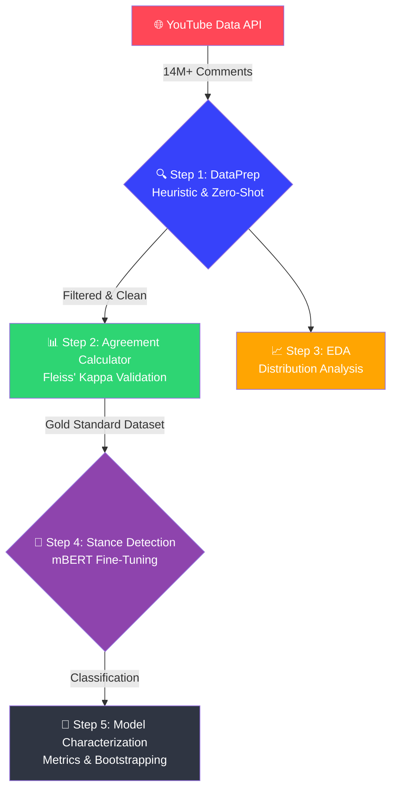
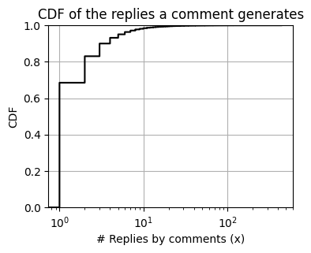
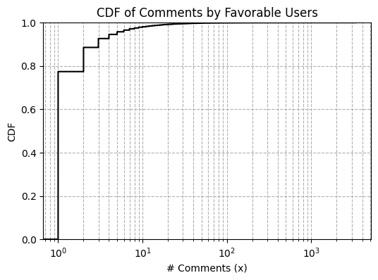
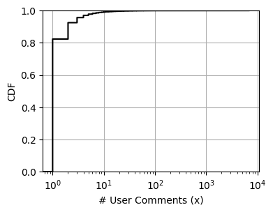

# 📊 YouTube NLP Pipeline

> **Large-Scale Data Engineering & Deep Learning Research Pipeline.**

> [!NOTE]
> **Research Artifact** — This repository contains the code architecture and statistical findings of an international research project analyzing 14M+ YouTube comments. Due to GDPR constraints, raw data is excluded, but the 5-step modular pipeline is available for review.

---

## 🤔 The Challenge

Analyzing public sentiment on controversial topics (like e-cigarettes) requires moving beyond basic keyword matching. Social media data is exceptionally noisy, multi-lingual, and riddled with sarcasm. 

To achieve scientific rigor, we needed an automated pipeline capable of:
1. **Ingesting** millions of unstructured comments.
2. **Filtering** out irrelevant noise using zero-shot semantic models.
3. **Classifying** nuanced stances (Favorable vs. Unfavorable) using fine-tuned Deep Learning.

---

## 🏗️ Pipeline Architecture

The solution is divided into a 5-step modular pipeline (available in the `notebooks/` directory).

---

## ✅ What It Does (The Modules)

*   **`1_DataPrep.ipynb`** : Ingests raw data, applies deduplication, language detection, and uses RoBERTa to filter out topically irrelevant content.
*   **`2_Agreement_Calculator.ipynb`** : Calculates Fleiss’ Kappa on manually annotated samples to guarantee inter-annotator reliability before training.
*   **`3_Data_Characterization.ipynb`** : Generates statistical distributions and WordClouds to understand the dataset organically.
*   **`4_Stance_Detection_Model.ipynb`** : Fine-tunes a **multilingual BERT (mBERT)** model specifically on the polarized social media dataset.
*   **`5_Model_Characterization.ipynb`** : Evaluates model robustness using precision, recall, F1-scores, and 95% bootstrap confidence intervals.

---

## 📈 Model Performance

The fine-tuned mBERT model achieved robust performance, successfully navigating sarcasm and class imbalance.

| Class | Precision (95% CI) | Recall (95% CI) | F1-Score (95% CI) |
|---|---|---|---|
| **Favorable** | 0.96 *(0.92 - 0.98)* | 0.82 *(0.77 - 0.87)* | 0.88 *(0.85 - 0.91)* |
| **Unfavorable** | 0.68 *(0.60 - 0.76)* | 0.94 *(0.89 - 0.98)* | 0.79 *(0.73 - 0.84)* |

---

## 📊 Engagement Analytics (EDA)

We discovered heavy-tailed distributions typical of coordinated social media behavior.

  
  
  

*Figures: Cumulative Distribution Functions (CDFs) illustrating the concentration of comments, channel activity, and reply generation.*

---

## 📄 Scientific Publication

The methodology and findings of this pipeline contributed directly to an international comparative research project.

> **📄 Scientific paper currently under peer-review (Available upon request)**

---

## 🛠️ Tech Stack

| Domain | Tools Used |
|---|---|
| **Data Ingestion** | YouTube Data API v3, `requests`, `pandas` |
| **Deep Learning / NLP** | `transformers` (HuggingFace), `torch`, `scikit-learn` |
| **Data Visualization** | `matplotlib`, `seaborn`, `wordcloud` |
| **Statistics** | `scipy`, Bootstrap Confidence Intervals, Fleiss' Kappa |
